# Architecture Diagram

*This diagram is auto-generated from `.foglamp/scan.json`. Run `node scripts/generate-architecture.mjs` to regenerate.*

```mermaid
graph TD

  %% Node styles by kind
  classDef entry fill:#e1f5fe,stroke:#01579b,stroke-width:2px;
  classDef cron fill:#fff3e0,stroke:#e65100,stroke-width:2px;
  classDef agent fill:#f3e5f5,stroke:#4a148c,stroke-width:2px;
  classDef model fill:#e8f5e9,stroke:#1b5e20,stroke-width:2px;
  classDef tool fill:#fff8e1,stroke:#f57f17,stroke-width:2px;
  classDef store fill:#fce4ec,stroke:#880e4f,stroke-width:2px;
  classDef external fill:#f5f5f5,stroke:#424242,stroke-width:2px;

  cli["CLI Entry"]
    %% entry: src/entry.ts
  gateway["Gateway"]
    %% entry: src/gateway/
  channels["Channel Router"]
    %% entry: src/channels/
  cron["Cron Scheduler"]
    %% cron: src/cron/
  agent-loop["Agent Loop"]
    %% agent: src/agents/agent-command.ts
  auto-reply["Auto-Reply"]
    %% agent: src/auto-reply/
  coding-agent["Coding Agent (ACP)"]
    %% agent: src/agents/acp-spawn.ts
  claude["Claude"]
    %% model: N/A
  gpt["GPT"]
    %% model: N/A
  gemini["Gemini"]
    %% model: N/A
  deepseek["DeepSeek"]
    %% model: N/A
  openrouter["OpenRouter"]
    %% model: N/A
  web-search["Web Search"]
    %% tool: Exa/Tavily/Brave
  memory["Memory"]
    %% tool: src/memory/
  terminal["Terminal"]
    %% tool: src/terminal/
  browser["Browser"]
    %% tool: Headless browser automation — page navigation, scraping, interaction
  image-gen["Image Gen"]
    %% tool: src/image-generation/
  vision["Vision"]
    %% tool: src/media-understanding/
  voice["Voice/TTS"]
    %% tool: src/tts/
  sessions["Sessions"]
    %% store: src/sessions/
  telegram["Telegram"]
    %% external: N/A
  discord["Discord"]
    %% external: N/A
  slack["Slack"]
    %% external: N/A
  whatsapp["WhatsApp"]
    %% external: N/A

  cli -->|"starts"| agent-loop
  gateway -->|"routes"| agent-loop
  channels -->|"delivers"| gateway
  cron -->|"triggers"| auto-reply
  agent-loop -->|"feeds"| auto-reply
  agent-loop -->|"calls"| claude
  agent-loop -->|"calls"| gpt
  agent-loop -->|"calls"| gemini
  agent-loop -->|"calls"| deepseek
  agent-loop -->|"routes"| openrouter
  auto-reply -->|"uses"| claude
  coding-agent -->|"uses"| gpt
  agent-loop -->|"queries"| web-search
  agent-loop -->|"reads/writes"| memory
  agent-loop -->|"executes"| terminal
  agent-loop -->|"drives"| browser
  agent-loop -->|"generates"| image-gen
  agent-loop -->|"analyzes"| vision
  agent-loop -->|"speaks"| voice
  coding-agent -->|"runs"| terminal
  coding-agent -->|"stores"| memory
  auto-reply -->|"sends"| telegram
  auto-reply -->|"sends"| discord
  auto-reply -->|"sends"| slack
  auto-reply -->|"sends"| whatsapp
  agent-loop -->|"persists"| sessions
  web-search -->|"caches"| sessions
  memory -->|"syncs"| sessions
  coding-agent -->|"logs"| sessions
  image-gen -->|"stores"| sessions

  %% Apply styles
  class agent-loop agent
  class auto-reply agent
  class browser tool
  class channels entry
  class claude model
  class cli entry
  class coding-agent agent
  class cron cron
  class deepseek model
  class discord external
  class gateway entry
  class gemini model
  class gpt model
  class image-gen tool
  class memory tool
  class openrouter model
  class sessions store
  class slack external
  class telegram external
  class terminal tool
  class vision tool
  class voice tool
  class web-search tool
  class whatsapp external
```

## Stats

- **Agents**: 3
- **Models**: 41
- **Tools**: 39
- **Integrations**: 22

## Top Models

- **Claude** (claude.ai)
- **GPT** (openai.com)
- **Gemini** (gemini.google.com)

## Top Tools

- **Web Search** (exa.ai)
- **Memory** (lancedb.com)
- **Terminal**
- **Browser**
- **Image Gen** (fal.run)
- **Vision** (deepgram.com)
- **Voice/TTS** (elevenlabs.io)
- **Video Gen** (runwayml.com)
- **Voyage Embed** (voyageai.com)
- **Firecrawl** (firecrawl.dev)

## Top Integrations

- **Telegram** (telegram.org)
- **Discord** (discord.com)
- **Slack** (slack.com)
- **WhatsApp** (whatsapp.com)
- **Signal** (signal.org)
- **Matrix** (matrix.org)
- **MS Teams** (microsoft.com)
- **Feishu** (feishu.cn)
- **LINE** (line.me)
- **Twitch** (twitch.tv)

